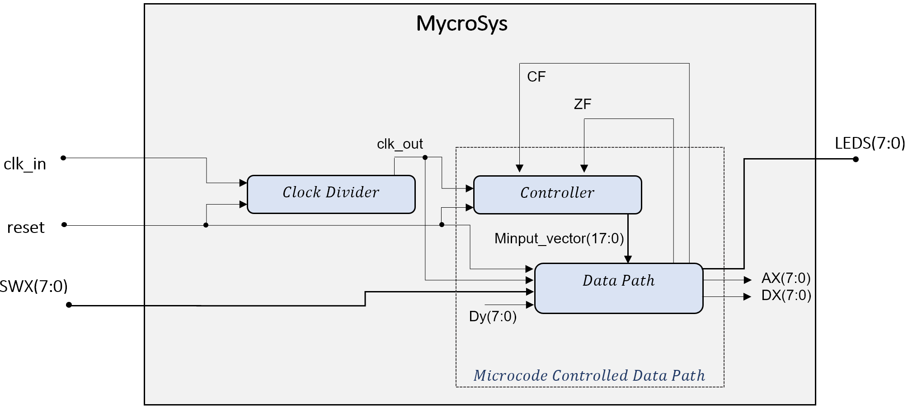
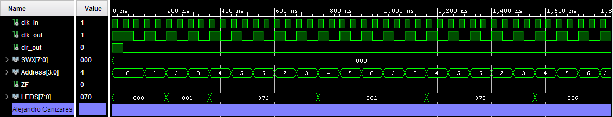
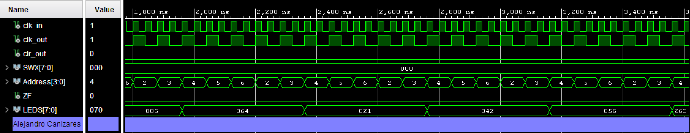
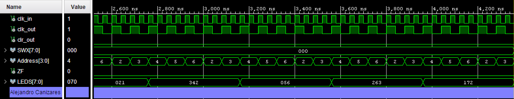
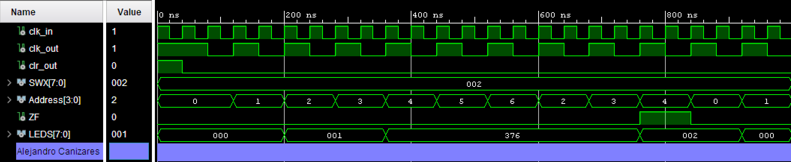

# FPGA Numerical Sequence

## Skills and tools used

> VHDL | Intel Altera FPGA | RTL | Test bench development and simulation | Microcode

## Summary
This project implements a numerical sequence (similar to the Fibonacci sequence) in an Intel FPGA board. Given the first two numbers in the sequence, S0 and S1, 
the next number in the sequence, Sn, is produced by bitwise inverting the previous number, Sn-1, and adding the second previous number Sn-2. 
To achieve the goal, the project uses VHDL to write the RTL design of a datapath, controller, ROM, and a shift register.

## Screenshots

 
  
 

